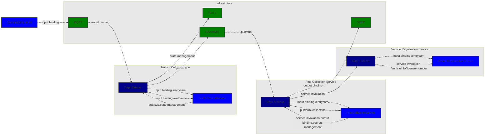
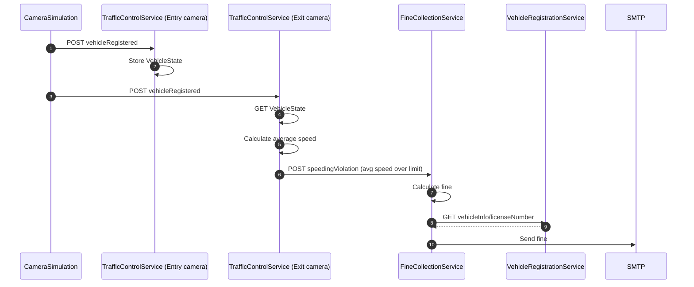
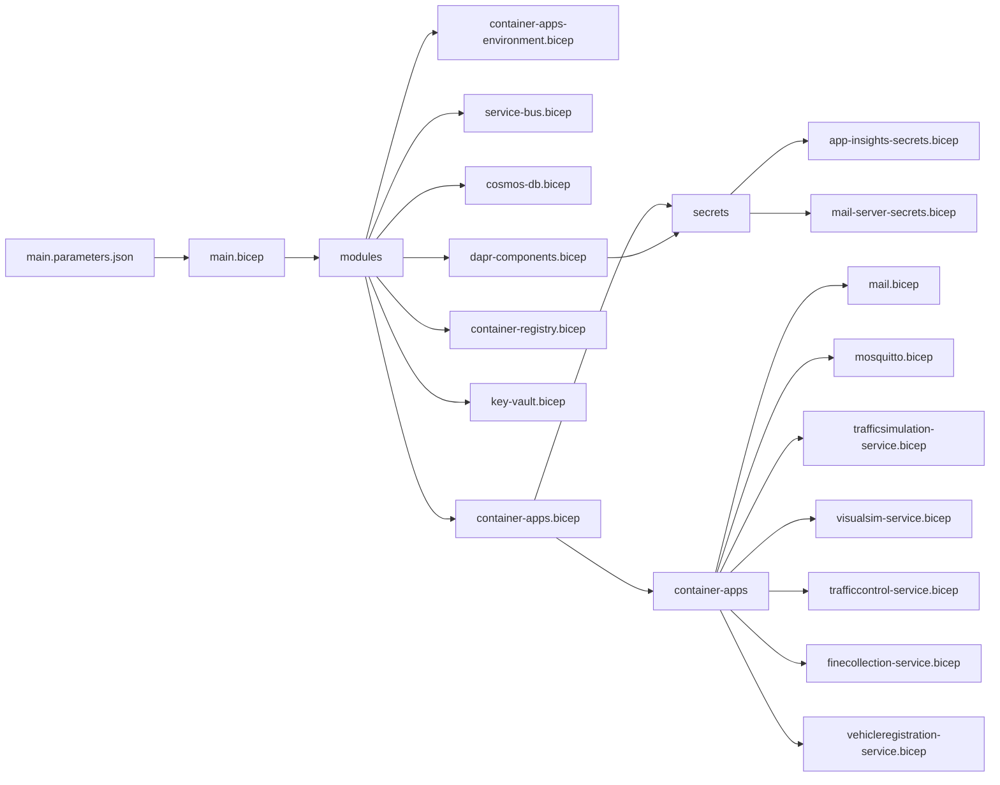

# DaprTrafficControl

This project is based on [https://github.com/EdwinVW/dapr-traffic-control]

and

[https://learn.microsoft.com/en-us/dotnet/architecture/dapr-for-net-developers/]

## Overall architecture


### Sequence




To run locally this project is using [tye](https://github.com/dotnet/tye) to run locally and deploy to Azure.

## Prerequisites
To run locally [dapr](https://docs.dapr.io/getting-started) is required.

### install dapr locally
1. Install [dapr CLI](https://docs.dapr.io/getting-started/install-dapr-cli/) (both for running locally and on Azure Kubernetes)
2. [Initialize}(https://docs.dapr.io/getting-started/install-dapr-selfhost/)

## Install AKS and dapr
### [Aks installation](https://docs.dapr.io/operations/hosting/kubernetes/cluster/setup-aks/)
note: setx BICEP_CLI_EXPERIMENTAL_FEATURES Extensibility to enable bicep deploy
1. Login
```shell
az login
```
2. Set variables
```shell
rg="rg-dtc"
aks="dtcaks"
loc="northeurope"
acr="acrdtc1231"
```
3. Create resource group
```shell
az group create --name $rg --location $loc
```
4. Create ACR 
[https://learn.microsoft.com/en-us/azure/aks/cluster-container-registry-integration?tabs=azure-cli]
Create ACR
```shell
az acr create -n $acr -g $rg --sku basic
```
5. Create AKS cluster with ephemeral disk and mariner host and attach acr
[https://learn.microsoft.com/EN-us/azure/aks/cluster-configuration]
```shell
az aks create --name $aks --resource-group $rg -s Standard_DS3_v2 --node-osdisk-type Ephemeral --os-sku mariner --enable-addons http_application_routing --generate-ssh-keys --enable-managed-identity --attach-acr $acr
```
6. Get Aks credentials
```shell
az aks get-credentials -n $aks -g $rg
```s

### [Install dapr using AKS Extension](https://docs.dapr.io/developing-applications/integrations/azure/azure-kubernetes-service-extension/)
1. Install dapr extension
```shell
az feature register --namespace "Microsoft.ContainerService" --name "AKS-ExtensionManager"
az feature register --namespace "Microsoft.ContainerService" --name "AKS-Dapr"
```
2. Check status
```shell
az feature list -o table --query "[?contains(name, 'Microsoft.ContainerService/AKS-ExtensionManager')].{Name:name,State:properties.state}"
az feature list -o table --query "[?contains(name, 'Microsoft.ContainerService/AKS-Dapr')].{Name:name,State:properties.state}"
```
3. Next, refresh the registration of the `Microsoft.KubernetesConfiguration` and `Microsoft.ContainerService` resource providers
```shell
az provider register --namespace Microsoft.KubernetesConfiguration
az provider register --namespace Microsoft.ContainerService
```
4. Enable the Azure CLI extension for cluster extensions
Install
```shell
az extension add --name k8s-extension
```
or update
```shell
az extension update --name k8s-extension
```
5. Create the extension and install Dapr on your AKS cluster
After your subscription is registered to use Kubernetes extensions, install dapr
```shell
az k8s-extension create --cluster-type managedClusters --cluster-name $aks --resource-group $rg --name myDaprExtension --extension-type Microsoft.Dapr --auto-upgrade-minor-version true
```
6. Verify installation
Confirm dapr control plane is installed
```shell
kubectl get pods -n dapr-system
```
## Run locally
From the root folder run
```shell
tye run --dashboard
```
Last argument will open the tye dashboard.

## Deploy to AKS
This project is using Github Actions to deploy
[https://learn.microsoft.com/en-us/azure/aks/kubernetes-action]

1. Create connection between Github and Azure
```shell
az ad sp create-for-rbac \
    --name "ghActiondtc" \
    --scope /subscriptions/edccd614-120e-4738-9be5-e63d2c6b7b10/resourceGroups/$rg \
    --role Contributor \
    --sdk-auth
```
Save the output as follows:

| Secret name | Secret value |
| :---------- | :----------- |
| AZURE_CREDENTIALS | The entire JSON output from the az ad sp create-for-rbac command |
| service_principal | The value of *clientId* |
| service_principal_password | The value of *clientSecret* |
| subscription | The value of *<*subscriptionId* |
| tenant | The value of *tenantId* |
| registry | The name of your registry |
| repository | Name of your repository |
| resource_group | The name of your resource group |
| cluster_name | The name of your cluster |

### Add observability
Dapr provides the option to get observability [https://docs.dapr.io/operations/monitoring/]

In this setup we will use [zipkin](https://docs.dapr.io/operations/monitoring/tracing/zipkin/) and [grafana](https://docs.dapr.io/operations/monitoring/metrics/grafana/)

We use [helm](https://learn.microsoft.com/en-us/azure/aks/quickstart-helm?tabs=azure-cli) to install a local grafana (TODO switch to managed)

### Install grafana
Navigate to K8s/observability/grafana folder. (TODO: Use managed grafana)

```shell
kubectl apply -f grafana_namespace.yaml

# install Prometheus
helm repo add prometheus-community https://prometheus-community.github.io/helm-charts
helm repo update
helm install dapr-prom prometheus-community/prometheus -n dapr-monitoring --set alertmanager.persistentVolume.enable=false --set pushgateway.persistentVolume.enabled=false --set server.persistentVolume.enabled=false

# install Grafana
helm repo add grafana https://grafana.github.io/helm-charts
helm repo update
helm install grafana grafana/grafana -n dapr-monitoring --set persistence.enabled=true

# display Grafana admin password
& ./get-grafana-password.ps1
```

## Use Azure Container apps
[https://docs.microsoft.com/en-us/azure/container-apps/quickstart-dotnet-azure-container-apps]
### The bicep strucure


1. login
```powershell 
az login
```

2. Add containerapp extension
```powershell
az extension add --name containerapp --upgrade
az provider register --namespace Microsoft.App
```

3. Set environment variables
```powershell 
$rg="rg-dtc"
$loc="northeurope"
```

4. Create resource group
```powershell 
az group create --name $rg --location $loc
```

5. Deploy 
```powershell
az deployment group create --resource-group $rg --template-file "./bicep/main.bicep" --parameters "./bicep/main.parameters.json"
```


az group delete -g $rg --yes --no-wait

### aks get oidc issuer url 
```powershell
az aks show -n $aks -g $rg --query "oidcIssuerProfile.issuerUrl" -otsv
```

### aks get kubeconfig
```powershell
az aks get-credentials -n $aks -g $rg
```
### aks set default namespace for kubectl
```powershell
kubectl config set-context --current --namespace=dtc
```